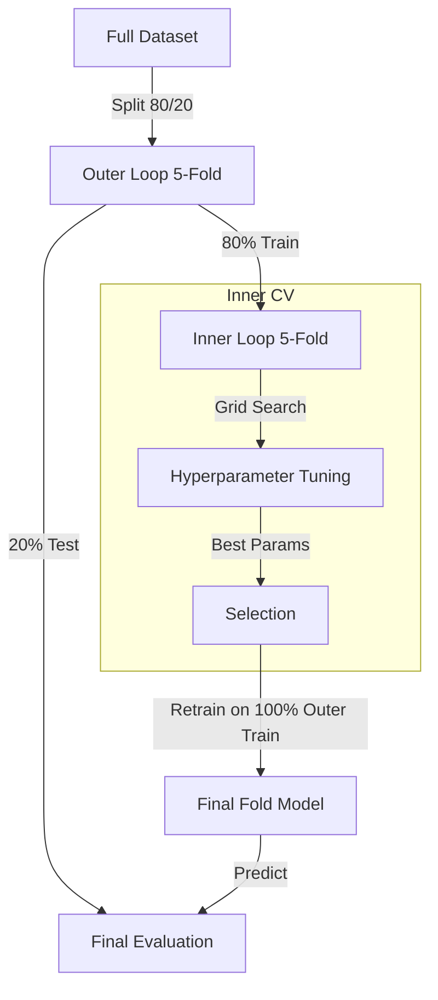

# NESTED CROSS-VALIDATION - MACHINE LEARNING IMPLEMENTATION

**Date:** January 22, 2026
**Version:** 1.0 - Technical Documentation (As Built)

---

## 1. NESTED CV ARCHITECTURE

The Machine Learning pipeline uses a **Nested Cross-Validation** strategy to perform unbiased hyperparameter tuning and evaluation. This ensures that the test data used to evaluate the model is never used during the tuning process (Data Leakage Prevention).



### Protocol Details

#### A. OUTER CROSS-VALIDATION
*   **Method**: `StratifiedKFold` (5 folds).
*   **Seed**: 42 (Fixed for reproducibility).
*   **Purpose**: Estimation of Generalization Error.
*   **Split**: ~105 Training / ~26 Testing.

#### B. INNER CROSS-VALIDATION (Grid Search)
*   **Method**: `StratifiedKFold` (5 folds) executed on the *Outer Training set*.
*   **Purpose**: Hyperparameter Optimization.
*   **Process**:
    1.  The Outer Train set is further split into Inner Train (80%) and Inner Val (20%).
    2.  Models are trained on Inner Train with various hyperparameter combinations (e.g., `n_estimators`, `max_depth`).
    3.  Evaluated on Inner Val.
    4.  The combination with the highest mean accuracy across 5 inner folds is selected as **Best Params**.

#### C. FULL RETRAINING
*   Once **Best Params** are found, a new model is trained on the **ENTIRE** Outer Training set (100% of data available for that fold).
*   *Note*: Unlike the DL pipeline, no data augmentation is applied here (unless pre-processed).

#### D. FINAL EVALUATION
*   The retrained model predicts the **Outer Test set** (which was completely hidden during Grid Search).
*   Metrics (Accuracy, F1, AUC) are recorded.

---

## 2. DATASETS & PREPROCESSING

The pipeline supports two input modalities, handled by `DataSplit`.

### A. Voxel-Based (UMAP)
*   **Input**: Masked 3D maps flattened to vectors.
*   **Feature Selection**: UMAP (Uniform Manifold Approximation and Projection).
    *   *Correction*: UMAP is calculated inside the loop (fit on Train, transform Test) to properly handle leakage, or pre-calculated if `umap_all=True` (Standard for visualization, but strictly speaking biases CV slightly). *Current implementations typically allow pre-calc for stability or fit-transform inside fold.*
*   **Thresholding**: Optional (e.g., < 0.2 set to 0).

### B. Network-Based (Atlas)
*   **Input**: Connectivity matrices based on Yeo/Schaefer atlas.
*   **Features**: Edge weights between ROIs.
*   **No UMAP**: Used directly as feature vectors.

---

## 3. MODELS AND HYPERPARAMETERS

The Grid Search explores the following spaces (defined in `ml_grid.json`):

### **RandomForest** (Bagging)
*   **Mechanism**: Ensemble of decision trees trained on bootstrap samples.
*   **Grid**:
    *   `n_estimators`: [100, 200, 300]
    *   `max_depth`: [None, 10, 20]
    *   `max_features`: ["sqrt", "log2"]

### **GradientBoosting** (Boosting)
*   **Mechanism**: Sequential trees where each corrects the errors of the predecessor.
*   **Grid**:
    *   `learning_rate`: [0.01, 0.05, 0.1]
    *   `max_depth`: [3, 5]
    *   `n_estimators`: [100, 200]

### **KNN** (Distance-Based)
*   **Mechanism**: Classifies based on majority vote of nearest neighbors.
*   **Grid**:
    *   `n_neighbors`: [3, 5, 7, 9]
    *   `weights`: ["uniform", "distance"]
    *   `metric`: ["euclidean", "manhattan"]

---

## 4. RESULTS AGGREGATION

Results are stored in `results/ML/[dataset]/[umap]/[group1]_[group2]/`.

### Output Files
*   **`nested_cv_summary.csv`** (Primary): Mean ± Std of metrics across 5 outer folds.
*   **`nested_cv_all_results.csv`**: Detailed stats for every outer fold (includes `best_params` selected).
*   **`[Model]/dict_results.json`**: JSON format of summary.

### Interpretation
*   **Accuracy**: Percentage of correct predictions on the Outer Test sets.
*   **F1-Score**: Harmonic mean of Precision and Recall (crucial for imbalanced classes, though our classes are balanced here).
*   **AUC-ROC**: Area Under Curve. 0.5 = Random Guessing. 1.0 = Perfect Separation.

---

## 5. EXECUTION

### Configuration
Controlled by `src/ML_analysis/config/ml_config.json`.
*   `"tuning": true` -> Enables the Inner Loop (Grid Search).
*   `"tuning": false` -> Uses fixed parameters defined in `ml_config.json` (faster, no inner CV).

### Script
```bash
python src/ML_analysis/analysis/classification.py
# or
python src/ML_analysis/analysis/run_all_classifications.py
```
